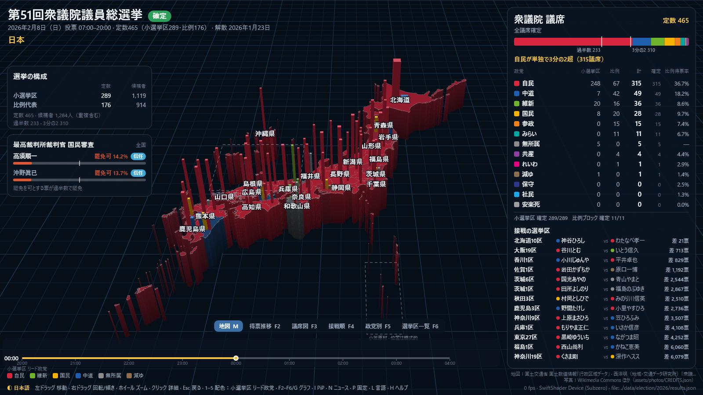
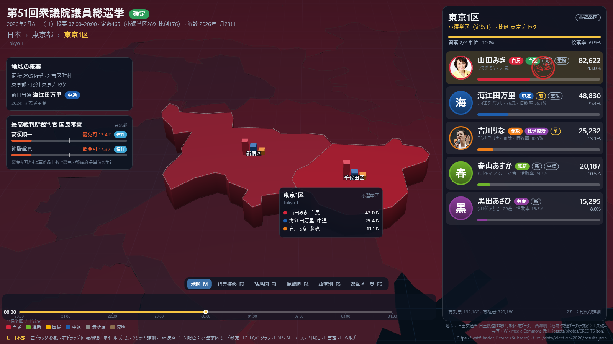
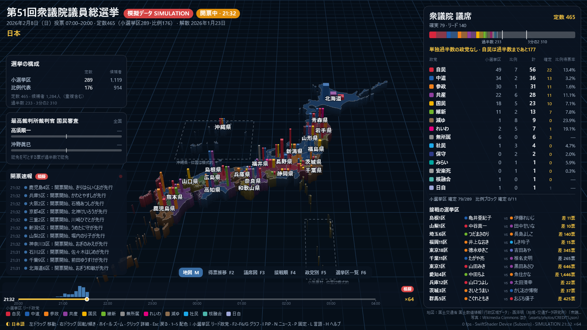
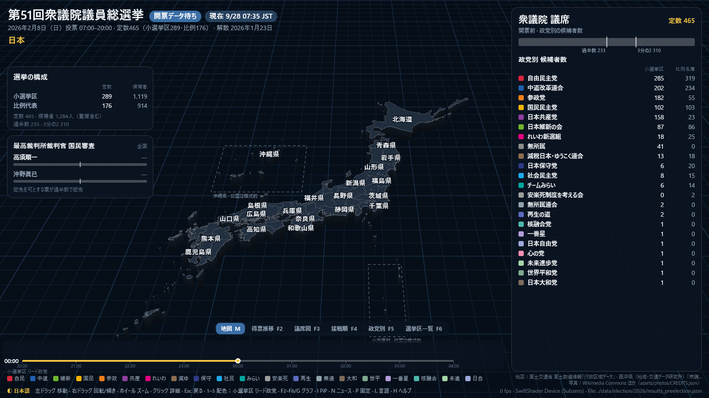
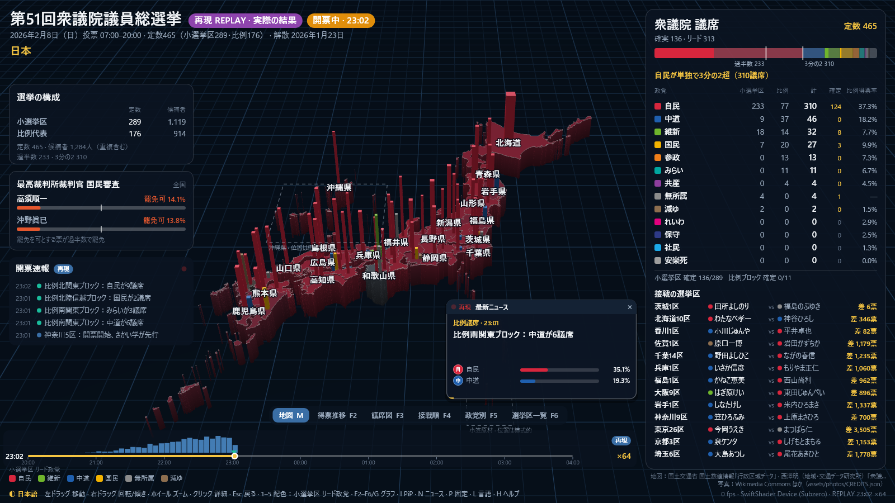
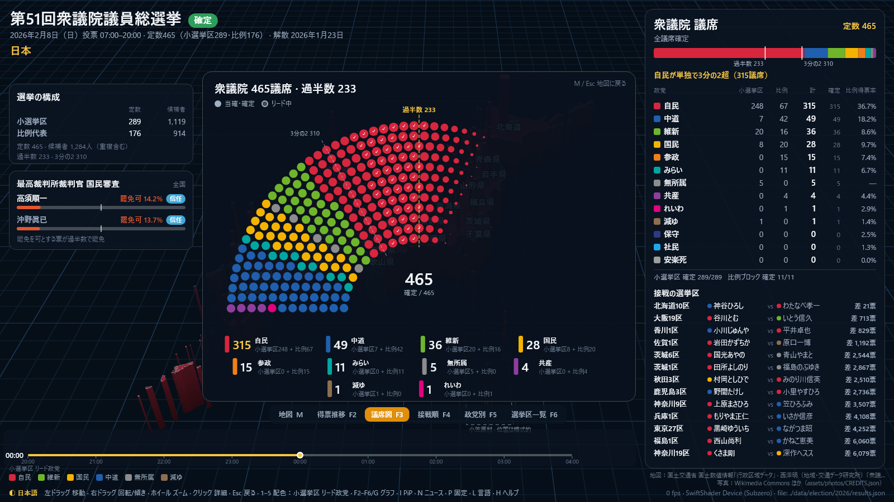
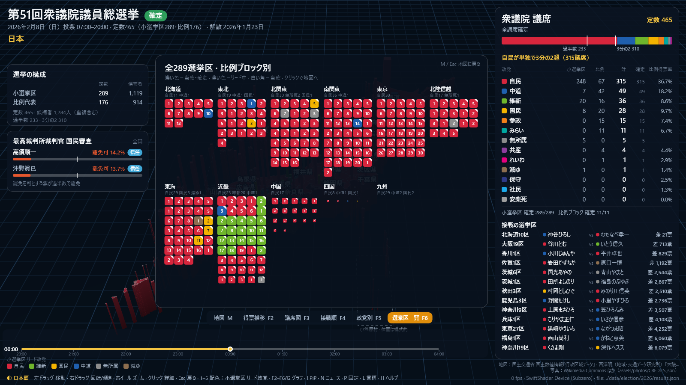
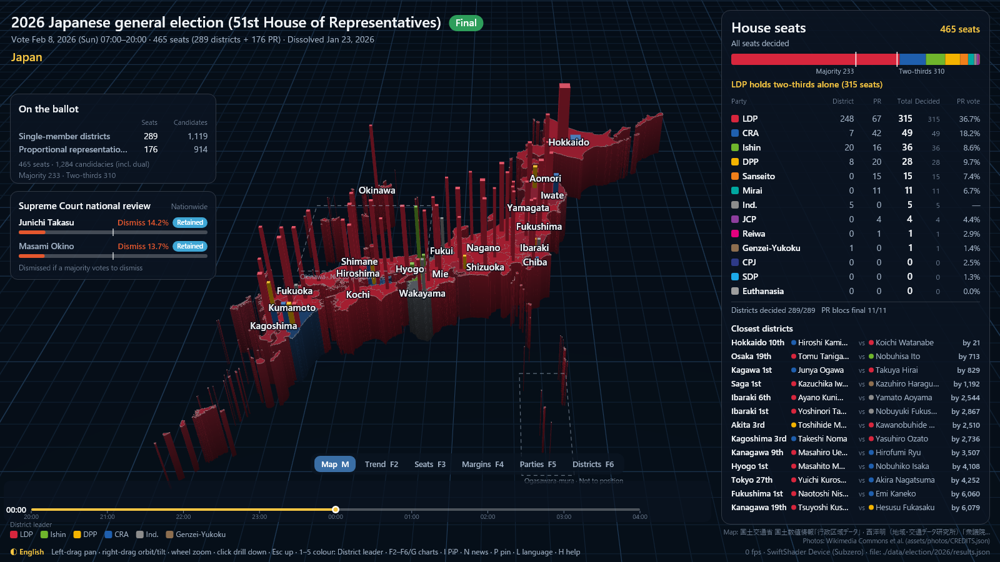
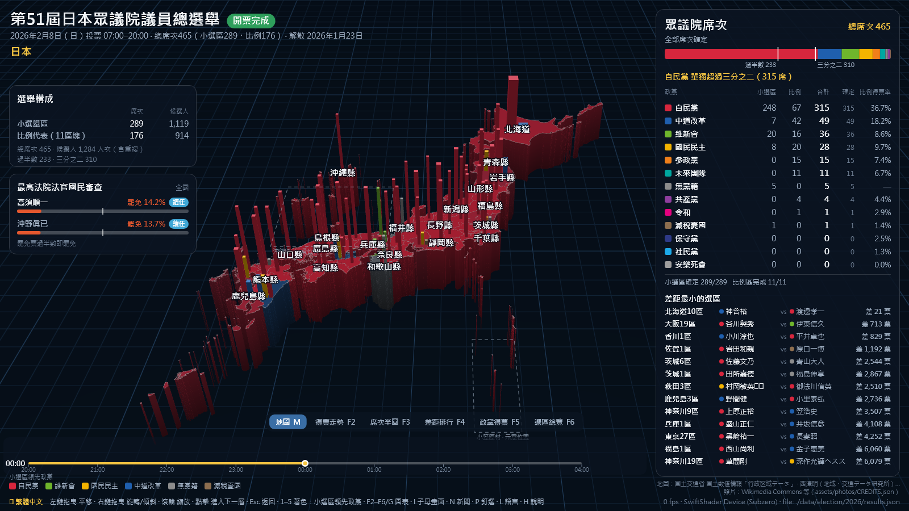
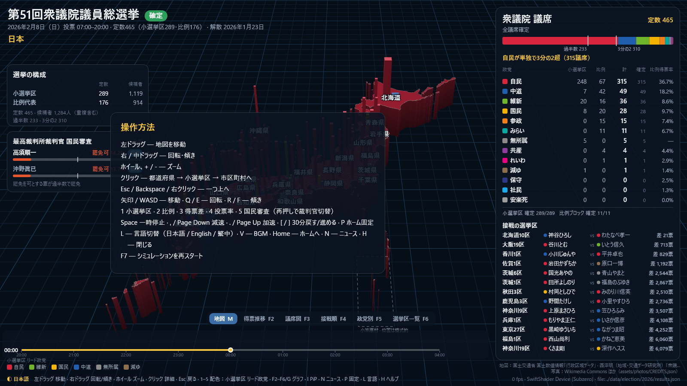

# jpy_election — 日本 2026 第51屆眾議院議員總選舉 3D 地圖與選舉儀表板

[日本語](README.md) · [English](README.en.md) · [繁體中文](README.zh-TW.md)

以 C++20、Bazel 9（僅使用 bzlmod）、Vulkan 與 Skia 打造的**第51屆日本眾議院議員總選舉**（2026年2月8日執行，含第27屆最高裁判所裁判官國民審查）互動式 3D 地圖與即時開票儀表板。

完整收錄日本總務省（MIC）官方開票確定數據，包含眾議院全部 465 個席次（289 個小選區＋11 個比例代表選區 176 席）、最高裁國民審查、全日本 289 小選區 1,119 位及比例單獨候選人在內共 1,284 位候選人詳細資料、432 張肖像照片，以及 1,931 個市町村與分割選區單元的 3D 地理拓撲模型。

預設語言為**日本語**（`--lang=ja`），並完整支援**英語**（`--lang=en`）與**繁體中文**（`--lang=zh-TW`）。



| | |
|---|---|
|  |  |
|  |  |

### 圖表與分析視圖

| | |
|---|---|
|  |  |
|  |  |

> **模擬模式說明**
> `--simulate` 參數為隨機、跨黨派的開票夜合成資料模擬器（模擬 20:00 投票截止至隔日 04:00）。畫面會全程標示「模擬資料 SIMULATION」。若要檢視或重現官方真實開票結果，請以預設方式啟動或使用 `--replay`。

---

## 主要特色

- **日本 3D 立體地圖：**
  - Vulkan 與 Skia 雙引擎即時立體繪圖（支援 4× MSAA、大氣霧效、海平面網格）。
  - 全國 47 都道府縣、289 小選區、1,931 個市町村與分割單元層層無縫縮放與鑽取（Drill-down）。
  - 沖繩縣與小笠原諸島以專屬子畫面繪製。
- **完整日本選舉制度演算法：**
  - 單一選區兩票制（小選區 289 席＋比例代表 11 區塊 176 席）。
  - 雙重登記（重複立候補）支援、自動計算**惜敗率**（Sekihairitsu）與比例復活當選判定。
  - 比例代表**漢狄法**（D'Hondt method）議席分配計算，並完全實現沒收保證金（有效票 1/10 未滿）喪失復活權利及名單不足時之他黨遞補規則。
- **最高裁判所裁判官 國民審查：**
  - 同日舉行之國民審查（高須順一裁判官、沖野眞巳裁判官）全國與各都道府縣罷免票比例與信任判定。
- **Skia 即時開票儀表板：**
  - 標示眾議院過半數（233 席）與三分之二絕對多數（310 席）的 465 席半圓圖。
  - 各黨當選席次（小選區／比例代表）、比例得票率、全日本最激烈選區差排行。
  - 當選確認（當確）印章、零開票勝選（ゼロ打ち）快訊、比例復活當選徽章。
- **模擬與重播模式：**
  - `--simulate`: 20:00 至 04:00 的開票夜模擬，支援 1 至 4096 倍速播放。
  - `--replay`: 依時間序列重現總務省官方當夜開票歷程。
  - `--preelection`: 選前倒數畫面，展示候選人登記陣容與選前席次。
- **即時新聞與情緒分類 (PiP)：**
  - 讀取日本主要媒體（NHK、Yahoo! 新聞、Google 新聞等）RSS/Atom 摘要。
  - 透過關鍵字或 OpenAI 相容 LLM 自動關聯候選人、選區與正負面情緒。
  - 支援子母畫面（PiP）最新新聞跑馬燈。
- **自體生成式環境音樂：**
  - 使用 Windows `waveOut`（Linux ALSA）程序合成背景音樂（按 `V` 靜音切換）。
- **Windows 與跨平台原生支援：**
  - 原生支援 Windows MSVC (C++20, /utf-8, DirectWrite)。
  - 內建 Google SwiftShader CPU Vulkan 驅動程式（`--swiftshader`），在無獨立 GPU 或 CI 環境下亦能正常執行。
  - 離線無視窗彩現與高解析度截圖（`--headless --screenshot=FILE`）。

---

## 官方確定席次（第51屆總選舉）

日本總務省公布之第51屆眾議院議員總選舉（2026年2月8日）最終當選結果：

| 政黨 | 小選區席次 | 比例代表席次 | 合計席次 | 比例得票率 |
|:---|---:|---:|---:|---:|
| **自由民主黨 (自民)** | 248 | 67 | **315** | 36.7% |
| **中道改革連合 (中道)** | 7 | 42 | **49** | 18.2% |
| **日本維新之會 (維新)** | 20 | 16 | **36** | 8.6% |
| **國民民主黨 (國民)** | 8 | 20 | **28** | 9.7% |
| **參政黨 (參政)** | 0 | 15 | **15** | 7.4% |
| **未來團隊 (みらい)** | 0 | 11 | **11** | 6.7% |
| **無黨籍** | 5 | 0 | **5** | — |
| **日本共產黨 (共產)** | 0 | 4 | **4** | 4.4% |
| **令和新選組 (れいわ)** | 0 | 1 | **1** | 2.9% |
| **減稅日本・憂國連合 (減ゆ)** | 1 | 0 | **1** | 1.4% |
| **日本保守黨 (保守)** | 0 | 0 | **0** | 2.5% |
| **社會民主黨 (社民)** | 0 | 0 | **0** | 1.3% |
| **安樂死制度考會** | 0 | 0 | **0** | 0.0% |
| **合計** | **289** | **176** | **465** | **100.0%** |

*全日本候選人詳細得票請參考 [docs/CANDIDATES.md](docs/CANDIDATES.md)。*

---

## 操作指南



| 操作方式 | 功能說明 |
|:---|:---|
| **滑鼠左鍵拖曳** | 平移地圖 |
| **滑鼠右鍵 / 中鍵拖曳** | 旋轉地圖角度與傾斜視角 |
| **滑鼠滾輪 / `+` `-`** | 放大 / 縮小 |
| **滑鼠左鍵單擊** | 深入點選區域（全國 → 都道府縣 → 小選區 → 市町村） |
| **滑鼠右鍵 / `Esc` / `Backspace`** | 返回上一層區域 |
| **方向鍵 / `W` `A` `S` `D`** | 移動視角 |
| **`Q` / `E`** | 左右旋轉視角 |
| **`R` / `F`** | 視角俯仰傾斜 |
| **`1`** | 小選區領先政黨著色（預設） |
| **`2`** | 比例代表首位政黨著色 |
| **`3`** | 得票差距著色 |
| **`4`** | 投票率著色 |
| **`5`** | 最高裁國民審查結果著色（再按一次切換受審裁判官） |
| **`M`** | 返回 3D 地圖主視圖 |
| **`F2`** | 得票趨勢圖表 |
| **`F3`** | 眾議院 465 席次半圓圖 |
| **`F4`** | 最接近差距選區排行 |
| **`F5`** | 政黨別席次與得票分佈表 |
| **`F6`** | 289 選區全覽網格圖 |
| **`Space`** | 暫停 / 繼續開票模擬 |
| **`[` / `]`** | 模擬時間倒退 / 前進 30 分鐘 |
| **`Page Down` / `Page Up`** | 調慢 / 調快模擬速度（×1 至 ×4096） |
| **`F7`** | 將模擬重置回 20:00 重新開始 |
| **`I`** | 開啟 / 關閉子母畫面（PiP）即時新聞 |
| **`N`** | 開啟 / 關閉新聞面板 |
| **`L`** | 切換顯示語言（日本語 → English → 繁體中文） |
| **`P`** | 將目前區域設定為下次啟動之首頁 |
| **`Home`** | 鏡頭回到首頁區域 |
| **`V`** | 開啟 / 關閉背景合成音樂 |
| **`H`** | 開啟 / 關閉操作說明覆蓋層 |

---

## 建置與執行

### 系統需求
- **作業系統**: Windows 10/11 (x64) 或 Linux (Ubuntu 22.04+)
- **編譯器**: MSVC (Visual Studio 2022) 或支援 C++20 之 GCC/Clang
- **建置工具**: Bazel 9 (bzlmod)
- **顯示介面**: 支援 Vulkan 1.2+ 之 GPU（或內建 CPU SwiftShader）

### Windows 建置與啟動

建議直接執行隨附之 `run.cmd` 腳本：

```cmd
# 啟動（若未建置會自動呼叫 Bazel 建置，預設為日語介面與確定結果）
.\run.cmd

# 以英語介面啟動
.\run.cmd --lang=en

# 以繁體中文介面啟動
.\run.cmd --lang=zh-TW

# 啟動開票模擬（合成資料）
.\run.cmd --simulate --sim_clock=21:30

# 重播官方確定結果之開票歷程
.\run.cmd --replay --sim_clock=23:00

# 啟動選前倒數視圖
.\run.cmd --preelection

# 聚焦特定選區（如東京1區）
.\run.cmd --focus=13-01

# 強制啟用 SwiftShader CPU 彩現
.\run.cmd --swiftshader

# 無視窗輸出截圖
.\run.cmd --headless --screenshot=screenshot.png
```

使用 Bazel 命令直接操作：

```cmd
# 編譯主程式
bazel build //:jpy_election

# 執行全數 7 個單元測試
bazel test //tests/...

# 執行主程式
bazel run //:jpy_election
```

### Linux 建置與執行

```sh
sudo apt install build-essential libvulkan1 mesa-vulkan-drivers libglfw3-dev \
                 libcurl4-openssl-dev libasound2-dev glslang-tools git

bazel run //:jpy_election
```

---

## 命令列參數

```
用法: jpy_election [flags]

基本設定:
  --root=DIR            專案根目錄（預設: .）
  --results=FILE        監視之開票結果 JSON（預設: data/election/2026/results.json）
  --lang=L              UI 語言: ja（預設, 日本語）, en（English）, zh-TW（繁體中文）
  --focus=CODE          啟動時對焦之區域代碼（如 13 表東京都, 13-01 表東京1區）
  --mode=N              著色模式: 0 小選區領先, 1 比例首位, 2 得票差距, 3 投票率, 4 國民審查
  --no_music            關閉背景環境合成音樂
  --width=W --height=H  視窗解析度（預設: 1600x900）

模擬與重播:
  --simulate            執行合成資料之開票夜 DEMO
  --replay              依時間序重播官方確定結果
  --preelection         選前倒數畫面
  --now=YYYY-MM-DDTHH:MM 自訂選前倒數基準時間（JST）
  --sim_clock=HH:MM     模擬起始時間（20:00 至 04:00 JST）
  --sim_speed=X         模擬倍速（1 至 4096，預設: 64）
  --seed=N              模擬隨機種子

無視窗彩現與錄影:
  --headless            離線無視窗彩現
  --screenshot=FILE     彩現後輸出 PNG 並結束程式
  --record=DIR          將連續圖框輸出至指定目錄
  --record_seconds=S    錄製長度（秒）
  --fps=F               錄製每秒圖框數
  --chart_tour=S        錄製期間每隔 S 秒輪流切換各圖表

新聞與情緒分析:
  --news                啟用 RSS/Atom 新聞擷取與分類
  --news_config=FILE    自訂新聞來源設定檔
  --mock_news           自動生成模擬新聞（--simulate 時預設啟用）
  --no_llm              停用 LLM，僅使用離線關鍵字分類
  --llm_base_url=URL    OpenAI 相容端點（預設: https://api.openai.com/v1）
  --llm_model=NAME      模型名稱（預設: gpt-4o-mini）
```

---

## 資料來源與處理流程

本專案資料處理腳本位於 `tools/`：

1. **`tools/fetch_raw.py`**:
   - 自日本總務省（MIC）下載第51屆與第50屆眾院選確定結果及候選人清單。
   - 下載西澤明先生（地域・交通數據研究所）「眾議院小選舉區 Shapefile（2022年改定版）」。
   - 下載 SmartNews SMRI 全日本自治體 TopoJSON。
2. **`tools/build_data.py`**:
   - 將 1,892 個市町村與北方領土整合為全日本 289 小選區所屬之 1,931 個選區單元。
   - 以空間索引與多邊形裁剪分割自治體。
   - 產出極度輕量精準之 `data/map/japan.topo.json`（8,759 個弧線）。
3. **`tools/build_election.py`**:
   - 解析總務省 Excel 與 PDF 候選人名冊，提取 22 個政黨、1,284 位候選人資料（含ふりがな讀音、真實姓名、雙重登記、惜敗率）。
   - 產出 `parties.json`, `candidates.json`, `election.json` 與 `results.json`。
4. **`tools/fetch_photos.py`**:
   - 自 Wikimedia Commons 下載 432 張具自由授權（CC-BY / CC0 / 公有領域）之候選人肖像照片。

---

## 授權條款

- **軟體本體**: Apache-2.0 License
- **地圖資料**:
  - 日本國土交通省 國土數值情報（行政區域資料）
  - 西澤明（地域・交通數據研究所）「眾議院小選舉區 Shapefile」
  - 聰明新聞 SmartNews 媒體研究所 (SMRI)
- **候選人照片**:
  - 照片作者及授權標註詳見 [assets/photos/CREDITS.json](assets/photos/CREDITS.json)。
